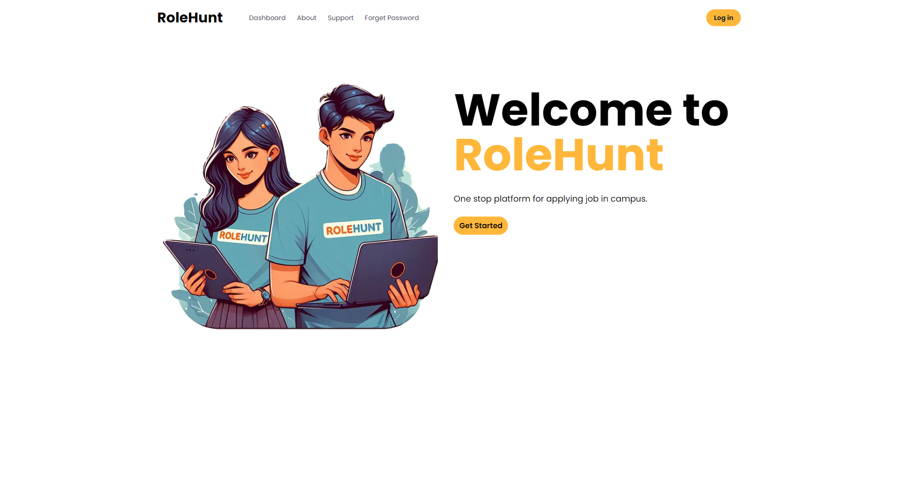
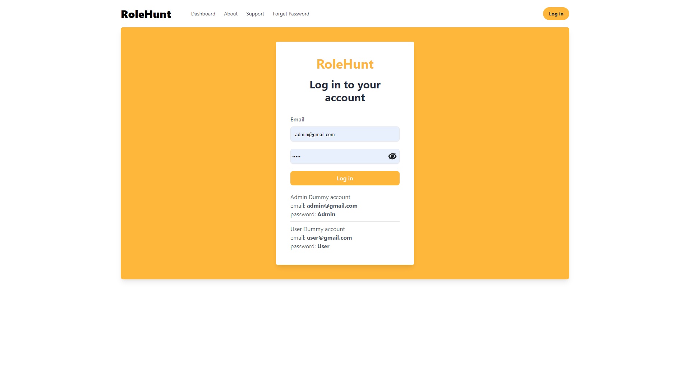
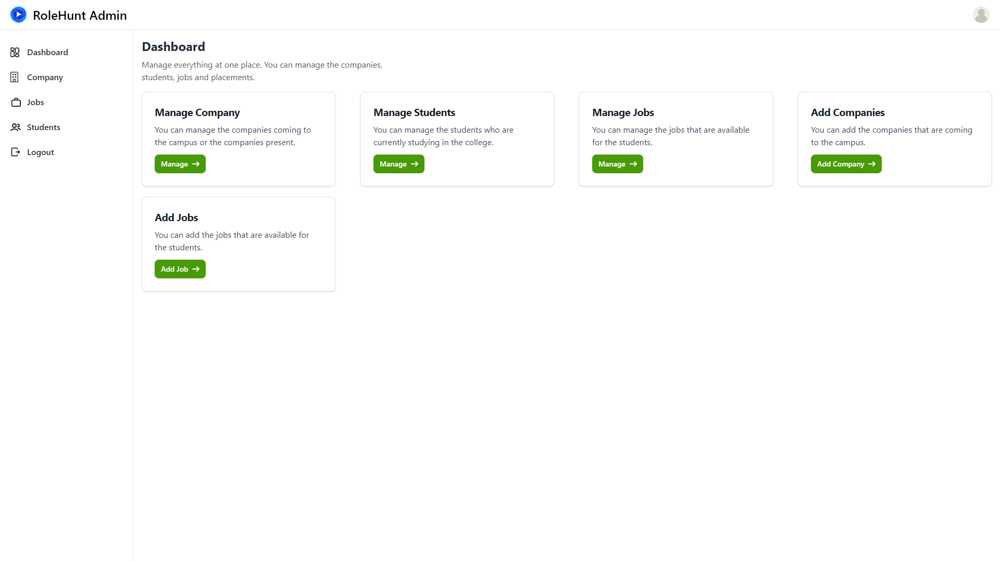
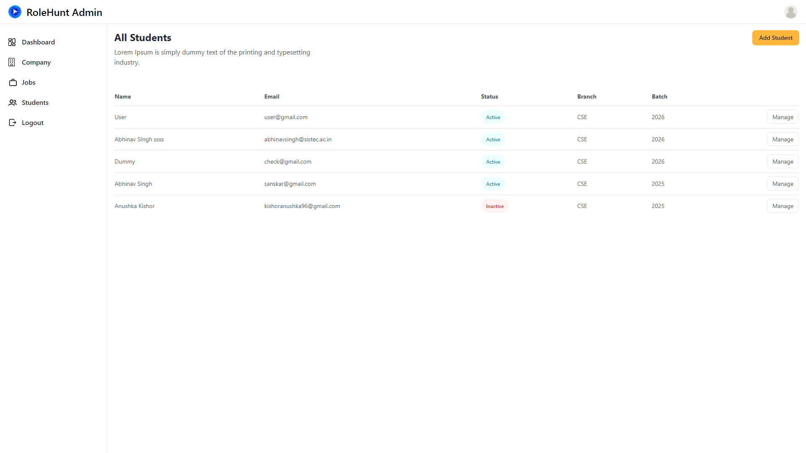
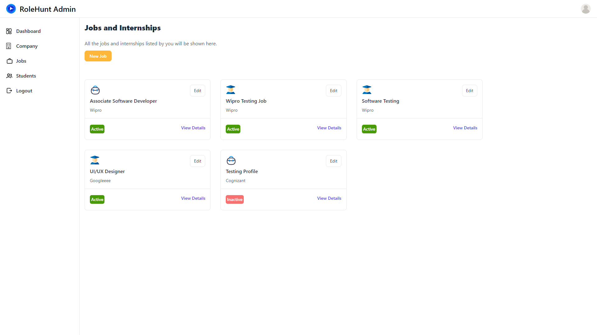

# RoleHunt Placement Management System

## Introduction
RoleHunt Placement Management System is a web application that helps students to apply for internships and placements. It is a platform where students can apply for internships and placements and placement cell can manage the applications and placements for the companies coming to the college.

## Features
- Students can apply for internships and placements.
- Placement cell can manage the applications and placements for the companies coming to the college.
- Companies can post internships and placements.
- Admin can manage the users, companies, and placements.

## Screenshots
### Home Page


### Login Page


### Admin Dashboard


### Manage Students


### Manage Jobs



## To run the project
1. Clone the repository
```
git clone https://github.com/imabhinavdev/rolehunt.git
```
2. Change the directory
```
cd rolehunt
```
3. Install the dependencies
```
npm install
```
4. Create a `.env` file in the root directory and add the following
```
MONGODB_URI=your_mongodb_uri
JWT_SECRET=your_jwt_secret
```
5. Run the project
```
npm start
```
6. Open the browser and go to `http://localhost:3000`

